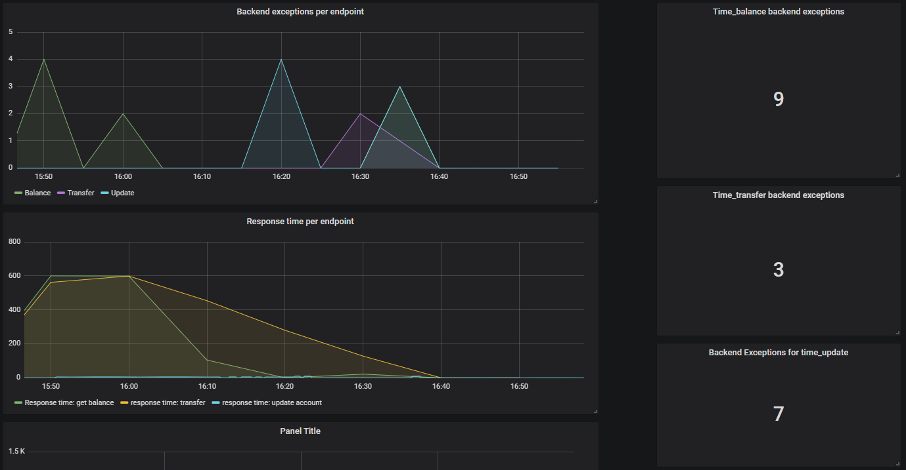

# Eksamen PGR301 

# Karakter: A

NB: Ettersom det ikke stod noe i eksamensteksten at commit-historikk vil vurderes av sensor, har jeg ikke ikke squashet commits, slik man bør gjøre for å få en ryddig commit-historikk. Vet at dette er noe som burde blitt gjort for å følge DevOps.

Drøfteoppgaver:

### 1. Beskriv med ord eller skjermbilder hvordan man kan konfigurere GitHub på en måte som gir bedre kontroll på utviklingsprosessen. Spesielt med tanke på å hindre kode som ikke kompilerer og feilende tester fra å bli integrert i main branch. 
 
For å unngå at kode som ikke kompilerer og feilende tester blir integrert i main branch kan man bruke Branch Protection. Man kan konfigurere en "branch protection rule" på main branch, slik at man må få pull requests reviewet av noen andre før den merges, eller at alle statussjekker må passere før merge. Slik konfigurerer man dette:
 
   o	Gå til settings inne på ditt repo
   o	Naviger til "Branches" i menyen til venstre
   o	Trykk på "Add rule" ved siden av "Branch protection rules"
   o	Legg til "main" eller hva navnet på main branch skulle være under "Branch name pattern"
   o	Velg "Require pull request before merging", slik at alle commits må gjøres til en annen branch enn den som er beskyttet, og kreve en pull request før de kan merges til           main branch. Her kan man også huke av for at hver pull request må ha et visst antall godkjennelser/reviews av en annen før den kan merges.
   o	Huk av på "Require status checks to pass before merging" , slik at commits ikke kan merges før alle statussjekker passerer. Søk deretter etter statussjekker som du ønsker       å ha med, i dette tilfellet "test"
 
 
### 2.	Beskriv med ord eller skjermbilder hvordan GitHub kan konfigureres for å sikre at minst ett annet medlem av teamet har godkjent en pull request før den merges. 
 
Igjen må man skru på branch protection på den branchen man ønsker å beskytte fra commits. 
Velg "Require pull request before merging",  og deretter "Require approvals". Velg så hvor mange som må godkjenne pull requests før merge.
 
### 3.	Beskriv hvordan arbeidsflyten for hver enkelt utvikler bør være for å få en effektiv som mulig utviklingsprosess, spesielt hvordan hver enkelt utvikler bør jobbe med Brancher i Github hver gang han eller hun starter en ny oppgave.
 
For å sikre en effektiv arbeidsflyt bør man for det første fokusere på å fjerne så mye "waste" som mulig i utviklingsprosessen.  Eksempler på "waste" kan være oppgaver som er delvis fullført, å måtte vente lenge på å få arbeid, dokumentasjon som ikke brukes, prosesser som ikke tilfører kundeverdi, og andre unødvendigheter. Det må fokuseres på å ikke forårsake merarbeid, og kun utvikle den funksjonaliteten som er etterspurt. Man må unngå å bytte mye mellom oppgaver, og avbrudd som leder til "context switching".  
 
Manuelle prosesser som kunne blitt automatisert leder også til "waste", da manuelle prosesser oftere er mer tidkrevende og utsatt for "menneskelige feil". Særlig funksjonell og ikke-funksjonell testing bør automatiseres. Manuelle tester kan føre til at uviklingsteamet får en falsk trygghet i forhold til teamet som lager tester. Derfor er det veldig viktig å bruke Github Actions og CI/CD workflows i prosessen. 
 
For å oppnå alt dette bør man implementere kontinuerlig integrasjon og VCS gjennom Trunk Based Development.
Trunk Based Development går ut på at hver utvikler deler opp arbeidet i mindre deler og merger dette med main branch minst en gang, noen manger flere, ganger om dagen. Dette er mye mindre tidkrevende og feilsikkert enn å bruke feature branches, der masse kode merges på én gang uten noen form for versjonskontroll eller CI. Til forskjell fra feature branches-tilnærmingen har man i trunk-based development kortlevde branches som man committer til, og utfører pull requests med code review og bygg-automatisering før man merger dette med trunk, eller master. Dette skjer i løpet av noen få timer, med flere utviklere som merger sine endringer inn i main kontinuerlig. Et sett med automatiserte tester som kjører etter hver commit til trunk sørger for at systemet alltid er oppe og fungerende. Man kan da lett se om CI prosessen har feilet, og kan rette opp i feilen raskt, eller "roll back" hvis man ikke finner feilen i løpet av kort tid. Man har som regel ikke mer enn tre eller færre aktive branches i repoet av gangen, som merges inn i trunk minst en gang om dagen. Trunk-based development er helt nødvendig for å oppnå CI (kontinuerlig integrasjon). Poenget med å committe små deler med kode av gangen er å unngå store merges som kan skape mye hodepine for alle parter.
 
Det er også veldig viktig med rene commits og håndtering av branches.  Hver commit bør handle om én feature, og bør ideelt sett ikke være avhengige av andre kodeendringer, slik at man senere kan Cherry-picke commits senere. Man bør også bruke git rebase for å "squashe" commits før man gjør en pull request til main/master branchen. Dette innebærer å rydde opp i commits ved å for eksempel fjerne de som er uten betydning eller ved å endre på commitmeldingen. Gode commitmeldinger er veldig viktig, slik at det er tydlig hva som har blitt gjort i hver commit, og for å raskt få et overblikk over hva som har blitt gjort. 
 
 
####4. SkalBank har bestemt seg for å bruke DevOps som underliggende prinsipp for all systemutvikling i banken. Er fordeling av oppgaver mellom API-teamet og "Team Dino" problematisk med dette som utgangspunkt? Hvilke prinsipper er det som ikke etterleves her? Hva er i så fall konsekvensen av dette?
 
 
**Prinsipper som ikke følges:**
 
**1. Samarbeid**
 
Problemer:
 
    o	Alle driver faktaløs "Blamestorming" uten å fokusere på å finne ut av hvor problemet ligger.
    o	Det finnes et team i SkalBank som jobber med manuelle tester og drift; "Team Dino". Teamet er på ca 100 ansatte og SkalBank vurderer å rekruttere ytterligere for å øke 			kvaliteten på leveransene som har vært fallende siden lansering
    o	Hver gang en ny versjon av API skal releases, lager tech lead "Jens" en JAR han gir til "Team Dino"".

Et av nøkkelprinsippene bak DevOps er samarbeid. Her virker det som de to teamene jobber veldig separat og overlater ansvar til hverandre, ettersom det foregår mye 					"Blamestorming". Dette er ganske problematisk hvis man skal få DevOps til å fungere. DevOps krever god kommunikasjon, tillit og feedback seg i mellom. Hele teamet bør ha 			ansvar og eierskap til applikasjonen fra idé til leveranse. Team Dino og team API burde derfor slått seg sammen til ett team som jobber sammen gjennom hele 							systemutviklingsprosessen.

Bør ikke bruke JAR, men flytte ferdigbyggede pakker fra miljø til miljø for å fjerne pakking som feilkilde, teks med Maven artifacts, Docker image eller Zip.
 
 
**2. Automasjon**
 
Problemer:

	o	Applikasjonen er veldig ustabil
	o	Det er vanskelig å si om problemet ligger i API eller kjernesystemet.
	o	Manuelle tester og drift
	o	Responstidene er veldig variabel, og Applikasjonen feiler med sporadiske "BackEndException"
	o	Mellom fem og ti utviklere committer til main branch kontinuerlig, uten nødvendigvis å kompilere koden og kjøre tester

Her er ingenting automatisert, CI/CD er ikke implementert. Tester, drift og deployment skjer manuelt. Dette er utrolig tidkrevende og skaper merarbeid for alle parter for å 		skjønne hvor feilen ligger når noe går galt. Uten automasjon er det større risiko for at menneskelige feil oppstår, og det tar mye lengre tid å finne feil når de oppstår. Å 		ha DevOps som underliggende prinsipp uten å ha implementert kontinuerlig integrasjon (CI) og kontinuelige leveranser (CD) er svært lite effektivt, fører til mye "waste" og er 	 ofte dømt til å mislykkes. 

Med CI integreres ny kode i små steg, med branch protection med pull requests og peer reviews eller statussjekker før merge skjer for å oppdage feil raskt. Hyppig integrering 	 kombinert etterfulgt av automatisert bygging og testing sikrer at koden fungerer som den skal. CI sørger for at man finner feil fort og dermed kan fikse de med en gang. 			Mangel på dette er da naturligvis at man ikke oppdager feil før senere i prosessen teamet  bruker lengre tid på å gjenopprette tjenesten etter feilen. 

Med CD sikrer man at deployment til produksjon med kvalitet, ved å levere hver lille endring til et produksjonsmiljø som sikrer at alt av funksjonelitet er på plass gjennom 		automatiserte tester. Denne prosessen bør også versjonskontrolleres og være lik for alle miljøet, hvis ikke kan dette bli kilden til feil. Bør også inkludere "smoke tests" i 	deployment-prosessen for å få rask tilbakemelding på om noe er feil, med rollback trigger dersom det oppstår. 
  
 
**3. Overvåking og feedback**
 
	Problemer:
	o	Overfladisk overvåkning, starter applikasjonen på nytt hver natt etter behov
	o	Det er umulig å se hva som faktisk er feil. Applikasjonen lager ikke logger, og gir ikke fra seg noe form for telemetri
	o	Ingen innsikt i applikasjonens tilstand

Solid og kontinuerlig overvåkning er nødvendig for å vite om en applikasjon fungerer som den skal.  Fremfor å overfladisk overvåke applikasjonen og starte den på nytt manuelt 	 hver natt etter behov, bør automatisert overvåkning implementeres med logs, traces og metrics. Med ordentlige disse verktøyene vil teamet bli gjort oppmerksomme på 				produksjonsfeil, bugs og andre mangler før de oppstår og vil gjøre det lettere å finne og løse problemet. Uten dette vil ikke teamet vite NÅR en feil oppstår, eller hva som 		forårsaket feilen - og man må fomle i mørket for å finne roten til problemet.

### Feedback -[x]

**Finne totalt antall BackEndExceptions**
select SUM(*) from http_server_requests group by exception

**Finne exceptions for hvert endpoint:**
select  SUM(*) from time_update group by exception (finne antall exceptions spesifikt for update)
select  SUM(*) from time_balance group by exception (finne antall exceptions spesifikt for balance)
select  SUM(*) from time_transfer group by exception (finne antall exceptions spesifikt for transfer)

**Finne responstider per endpoint**
select * from  time_update(eller time_balance, time_transfer)

docker run --rm -d --name influxdb -p 8083:8083 -p 8086:8086 -p 25826:25826/udp -v %cd%/influxdb:/var/lib/influxdb -v %cd%/influxdb.confro -v %cd%/types.dbro influxdb:1.0
docker run -d -p 3000:3000 --name grafana grafana/grafana:6.5.0

Screenshot av metrics:

### Terraform -[x]

Hvorfor funket terraformkoden i dette repoet for "Jens" første gang det ble kjørt? Og hvorfor
feiler det for alle andre etterpå, inkludert Jens etter at han ryddet på disken sin og slettet
terraform.tfstate filen?

Dette funket for Jens første gang det ble kjørt fordi dette var hans unike bucket. Det feiler for alle andre fordi bucketen med han laget allerede eksisterer.
Hver bucket må være unik for hver AWS-bruker, alle må ha sin egen unike bucket.

ASW CLI

For å lage en bucket ved hjelp av CLI kan hen bruke denne kommandoen:

    aws s3api create-bucket --bucket my-bucket --region eu-west-1 --create-bucket-configuration LocationConstraint=eu-west-1

For å konfigurere AWS-nøkler må sensor først lage access keys for sin bruker manuelt:

     1. Gå inn på sin IAM bruker i AWS Console.
     2. Velge "Users" i navigasjonspanelet.
     3. Velge navnet på sin egen bruker, og velge Security credentials
     4. Trykke på "Create Access Key" i Access Key seksjonen
     5. Trykk "Show" for å vise Access key og Secret access key. Last ned .csv fila med nøkkelparet for å lagre de, da
        disse kun vises en gang.
    
    Derretter må sensor bruke AWS CLI for å konfigurere access keys.
        aws configure
        AWS Access Key ID [None]: ACCESSKEY
        AWS Secret Access Key [None]: SECRETACCESSKEY 
        Default region name [None]: eu-west-1
        Default output format [None]: json

### Docker -[x]

For å bygge et container image kjører man:

    docker build . 

 For å gi container imaget kan man legge til en tag, f.eks:

    docker build . --tag app

For å starte en container og lytte på port 7777:

    docker run -p 7777:80 ceiv001/app

For å kjøre samme applikasjon to ganger, hvor den ene bruker port 7777 og den andre 8888:

    docker run -d -p 7777:80 navn_på_image
    docker run -d -p 8888:80 navn_på_image

 
